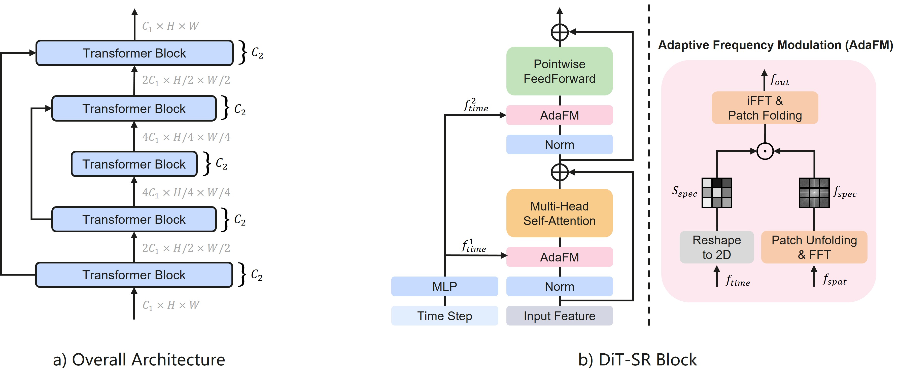

<div align="center">
<h2>Effective Diffusion Transformer Architecture for Image Super-Resolution</h2>
<a href='https://arxiv.org/abs/2409.19589'></a>
<div>
    <a href='https://github.com/kunncheng'>Kun Cheng* <sup>1</sup></a>&emsp;
    <a href='https://github.com/kunncheng/DiT-SR'>Lei Yu* <sup>2</a>&emsp;
    <a href='https://scholar.google.com/citations?hl=en&user=kSPs6FsAAAAJ&view_op=list_works&sortby=pubdate' target='_blank'>Zhijun Tu <sup>2</sup></a>&emsp;
    <a href='https://github.com/LearningHx'>Xiao He <sup>1</sup></a>&emsp;
    <a href='https://github.com/kunncheng/DiT-SR'>Liyu Chen <sup>2</sup></a>&emsp;<br/>
    <a href='https://github.com/kunncheng/DiT-SR'>Yong Guo <sup>3</sup></a>&emsp;
    <a href='https://web.xidian.edu.cn/mrzhu/en/index.html'>Mingrui Zhu <sup>1</sup></a>&emsp;
    <a href='https://web.xidian.edu.cn/nnwang/'>Nannan Wang <sup>1</sup></a>&emsp;
    <a href='https://see.xidian.edu.cn/faculty/xbgao/'>Xinbo Gao <sup>4</sup></a>&emsp;
    <a href='https://scholar.google.com/citations?user=o-3D3K4AAAAJ&hl=zh-CN'>Jie Hu <sup>2</sup></a>&emsp;
</div>
<br>
<div>
    <sup>1</sup> Xidian University &emsp; <sup>2</sup> Huawei Noah's Ark Lab &emsp; <br/><sup>3</sup> CBG, Huawei &emsp; <sup>4</sup> Chongqing University of Posts and
Telecommunications
</div>
<div align="justify">

## 🔎 Introduction 

We propose DiT-SR, an effective diffusion transformer for real-world image super resolution:
 - Effective yet efficient architecture design;
 - Adaptive Frequence Modulation (AdaFM) for time step.

<p align="center">
  
</p>


## ⚙️ Dependencies and Installation

```
git clone https://github.com/kunncheng/DiT-SR.git
cd DiT-SR

conda create -n DiT_SR python=3.10 -y
conda activate DiT_SR
pip install -r requirements.txt
```

## 🌈 Training
### Datasets
The training data comprises [LSDIR](https://data.vision.ee.ethz.ch/yawli/index.html), [DIV2K](https://data.vision.ee.ethz.ch/cvl/DIV2K/), [DIV8K](https://ieeexplore.ieee.org/document/9021973), [OutdoorSceneTraining](https://mmlab.ie.cuhk.edu.hk/projects/SFTGAN/), [Flicker2K](https://www.kaggle.com/datasets/hliang001/flickr2k) and the first 10K face images from [FFHQ](https://github.com/NVlabs/ffhq-dataset). We saved all the image paths to ```txt``` files. For simplicity, you can also just use the LSDIR dataset.

### Pre-trained Models
Several [checkpoints](https://drive.google.com/drive/folders/15EQYY3aKUKB9N3ec-AsXAZlhdCFzhT4R?usp=sharing) should be downloaded to ```weights``` folder, including autoencoder and other pre-trained models for loss calculation.

### Training Scripts
**Real-world Image Super-resolution**
```
torchrun --standalone --nproc_per_node=8 --nnodes=1 main.py --cfg_path configs/realsr_DiT.yaml --save_dir ${save_dir}
```

**Blind Face Restoration**
```
torchrun --standalone --nproc_per_node=8 --nnodes=1 main.py --cfg_path configs/faceir_DiT.yaml --save_dir ${save_dir}
```


## 🚀 Inference and Evaluation
**Real-world Image Super-resolution**

Real-world datasets: [RealSR](https://github.com/wyf0912/SinSR/tree/main/testdata), [RealSet65](https://github.com/wyf0912/SinSR/tree/main/testdata); Synthetic datasets: LSDIR-Test; Pretrained [checkpoints](https://drive.google.com/drive/folders/15EQYY3aKUKB9N3ec-AsXAZlhdCFzhT4R?usp=sharing).
```
bash test_realsr.sh
```

**Blind Face Restoration**

Real-world datasets: [LFW](https://xinntao.github.io/projects/gfpgan), [WebPhoto](https://xinntao.github.io/projects/gfpgan), [Wider](https://shangchenzhou.com/projects/CodeFormer/); Synthetic datasets: CelebA-HQ; Pretrained [checkpoints](https://drive.google.com/drive/folders/15EQYY3aKUKB9N3ec-AsXAZlhdCFzhT4R?usp=sharing).
```
bash test_faceir.sh
```
For the synthetic datasets (LSDIR-Test and CelebA-HQ), we are unable to release them due to corporate review restrictions. However, you can generate them yourself using these [scripts](https://github.com/zsyOAOA/ResShift/tree/journal/scripts).

## 🎓 Citiation
If you find our work useful in your research, please consider citing:
```
@inproceedings{cheng2025effective,
  title={Effective diffusion transformer architecture for image super-resolution},
  author={Cheng, Kun and Yu, Lei and Tu, Zhijun and He, Xiao and Chen, Liyu and Guo, Yong and Zhu, Mingrui and Wang, Nannan and Gao, Xinbo and Hu, Jie},
  booktitle={Proceedings of the AAAI Conference on Artificial Intelligence},
  volume={39},
  number={3},
  pages={2455--2463},
  year={2025}
}
```

## ❤️ Acknowledgement
We sincerely appreciate the code release of the following projects: [ResShift](https://github.com/zsyOAOA/ResShift), [DiT](https://github.com/facebookresearch/DiT), [FFTFormer](https://github.com/kkkls/FFTformer), [SwinIR](https://github.com/JingyunLiang/SwinIR), [SinSR](https://github.com/wyf0912/SinSR), and [BasicSR](https://github.com/XPixelGroup/BasicSR).
